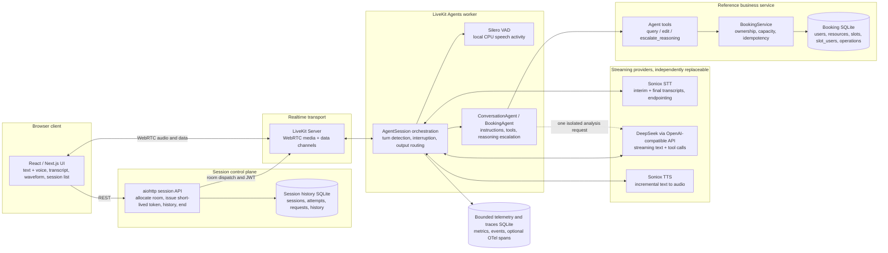

# OpenTalk

OpenTalk is a browser-based, realtime voice-assistant stack. It combines WebRTC transport, a native
LiveKit Agents session, independently replaceable streaming ASR / LLM / TTS providers, tool-using
backend services, and durable session history. The repository includes a text-only agent entry point,
a local microphone console, a minimal React/Next.js web client, Docker Compose packaging, and a
booking database workload that exercises the full agent-to-service path.

The booking workload is used as a concrete reference for a talkbot: users ask in natural language
about meeting rooms, desks, or equipment, the agent queries real SQLite data, asks for clarification
or confirmation, and writes changes through a constrained, transactional service API. The same core
session, provider, and tool orchestration can be reused for other voice-enabled backend tasks.

---

## Demo Video
https://www.youtube.com/watch?v=qIVQs0rmlEs

## 1. What OpenTalk is

- A streaming speech pipeline: microphone audio -> VAD/STT -> agent -> LLM/tools -> TTS -> browser
  playback, with interim text and cancellation.
- A reusable `ConversationAgent` and a booking-specific `BookingAgent` that adds business tools.
- Provider factories for Soniox streaming STT, OpenAI-compatible streaming Chat Completions, and
  Soniox streaming TTS. Each provider is configured independently and returns a native LiveKit
  plugin instance.
- A local CPU Silero VAD used for speech activity, endpointing support, and barge-in.
- A reference office-booking service with a normalised SQLite schema, read-only SQL query tool, a
  constrained add/delete/update tool, idempotent operations, ownership checks, and capacity checks.
- Independent SQLite stores for business data, resumable session history, and bounded telemetry /
  traces.
- A minimal Next.js client that connects directly to LiveKit, supports text and voice modes, shows
  transcripts and a waveform, and talks to a same-origin session-control API.
- Local and Docker startup paths, component-level smoke tools, offline tests, and optional live
  integration tests.

The rest of this document describes the task, architecture, design choices, incremental development
path, implementation lessons, future work, and how to configure and run the project.

---

## 2. Talkbot task: functional and non-functional requirements

A talkbot is not just speech recognition followed by a chat response. It must maintain a realtime
conversation, decide when the user has finished speaking, orchestrate tools, stream text and audio
concurrently, react to interruptions, and persist enough state for a coherent multi-turn experience.

### 2.1 Reference task

The reference workload is an office resource-booking assistant:

- The user talks or types in Chinese, English, or a mixture of both.
- The assistant can discover resources, inspect availability, list the current user's bookings, and
  answer non-standard questions by querying the business database.
- For a mutation, the assistant must describe the exact intended change and obtain natural-language
  confirmation in a later user turn.
- The assistant can add a booking, cancel a booking, or move a booking to a new resource/time.
- The assistant must not change another user's data and must not silently bypass ownership,
  capacity, time-window, or idempotency checks.
- The backend service is intentionally replaceable; new services should be addable as tools without
  rewriting the session or transport layers.

### 2.2 Functional requirements

| Area | Requirement |
| --- | --- |
| Conversation | Natural multi-turn voice or text interaction, with concise spoken-style answers. |
| Streaming | ASR, LLM output, and TTS audio stream independently; playback can start before the full answer is generated. |
| Turn handling | Detect start/end of user speech and avoid sending partial ASR hypotheses to the LLM. |
| Interruption | A user can barge in while the assistant is speaking; the obsolete response and queued audio stop, but already committed business work remains consistent. |
| Multilingual input | Preserve Chinese/English and code-switched content within an utterance and across turns. |
| Language preference | Track an optional `preferred_response_language` and apply it to later assistant output/TTS where supported. |
| Tools | Allow the model to inspect data and perform constrained business actions with structured arguments. |
| Confirmation | Mutating actions require an explicit later-turn agreement; the backend still enforces the real safety rules. |
| Persistence | Keep resumable conversation history and user data separate from bounded diagnostics and business records. |
| Traces | Record model/tool/session events and optional OpenTelemetry spans for debugging and latency analysis. |
| Frontend | Minimal browser UI for text chat, voice capture, playback, transcript, connection state, and session selection. |

### 2.3 Non-functional requirements

| Area | Requirement and current design response |
| --- | --- |
| Latency | Use streaming plugins, disable speculative pre-generation, keep a fast default model profile, and allow TTS to start as soon as text is available. |
| Interruption responsiveness | Keep the microphone open during playback; use Silero VAD plus LiveKit's native interruption handling rather than an app-level "stop audio" hack. |
| Reliability | Use explicit session attempts, heartbeats, leases, stale-response checks, transactional writes, and idempotent request keys. |
| Safety | Fixed caller identity for the reference service, read-only SQL by default, write tools constrained to the caller, and backend validation independent of model wording. |
| Observability | Record native model metrics, tool outcomes, usage, and optional OTel spans without unbounded logging of private audio or full prompts. |
| Replacability | ASR, LLM, and TTS are selected by configuration and wrapped in small factories. Business logic does not import voice or model SDKs. |
| Portability | Run as a text agent, local Python services, or a Docker Compose stack. The browser only receives short-lived room tokens. |
| Resource bounds | Query row/step/time limits, bounded conversation context, bounded diagnostic queues, telemetry retention, and a maximum session duration. |
| Privacy | Provider credentials stay on the backend. The browser receives no model or LiveKit API secrets. |
| Maintainability | Small modules, native framework interfaces, offline component tests, and optional paid live tests. |
| Current scale | Optimised for a local, single-user deployment with SQLite and an in-process worker. Cloud concurrency and multi-tenancy are future work. |

---

## 3. Architecture, technology choices, and internal design

### 3.1 Architecture diagram



### 3.2 Core technology choices and why they were made

#### LiveKit as the realtime framework

LiveKit provides the room, WebRTC transport, media routing, data channel, participant lifecycle, and
native LiveKit Agents primitives. The Python `AgentSession` composes STT, LLM, TTS, VAD, turn
detection, output routing, tool execution, and interruption handling behind one session abstraction.
This avoids building a custom WebSocket audio protocol, jitter buffer, playback queue, and barge-in
state machine.

The browser stack is also native to LiveKit: `livekit-client` and `@livekit/components-react` can use
the same room model, participant audio, data messages, and RPC controls as the server. LiveKit Server
can dispatch a named agent into a newly allocated room, so the frontend does not need custom media
signalling.

#### Soniox for streaming STT and TTS

Soniox offers low-latency streaming speech-to-text and text-to-speech APIs with native LiveKit
plugins. The STT path returns interim and final segments, supports endpointing and language hints,
and can preserve mixed Chinese/English text. The TTS path accepts incremental text, buffers it at a
sentence-like boundary, and returns PCM audio while generation is still in progress.

Using one provider for STT and TTS also keeps credential and operational complexity low for the
reference deployment. The providers are not hard-wired: any LiveKit-compatible STT or TTS plugin
that satisfies the same streaming contract can be substituted. Multilingual quality, language
identification, code-switch handling, pronunciation, and latency are properties of the chosen
provider and model, not guarantees of the orchestration layer.

#### OpenAI-compatible DeepSeek for the LLM

The default LLM profile uses `deepseek-flash` at `https://api.deepseek.com` through an
OpenAI-compatible Chat Completions endpoint. DeepSeek is a practical low-latency default for
streaming text and tool calls, and the OpenAI-compatible interface keeps the application portable
across many providers. `config/llm.toml` controls base URL,
model, credential variable, temperature, token limit, timeout, and provider-specific `extra_body`
options.

The default profile disables thinking (`thinking.type = "disabled"`) so ordinary responses start
quickly. A separate reasoning profile can be enabled for an isolated stronger analysis request, as
described in the escalation section below. Any replacement model must support streaming and tool
calls; provider-specific options must be checked rather than assumed.

#### Silero VAD

Silero VAD runs locally on CPU through the LiveKit plugin. It is inexpensive, has no network round
trip, and is sufficient to detect speech start/stop and trigger interruption. LiveKit uses the VAD
signal together with STT endpointing: STT determines the text content and completed turn, while VAD
helps detect user speech while the assistant is speaking. This combination keeps interruption
latency low without sending extra audio to a dedicated service.

#### SQLite stores

Business records, session history, and bounded diagnostics use separate SQLite files. This gives the
reference deployment a zero-ops persistence model with transactions, stable IDs, and simple local
backups; the session and telemetry stores enable WAL. The separation is intentional:

- booking data is owned by the business service;
- session history is needed for resume and prompt context;
- telemetry/traces are bounded diagnostics that can be dropped by retention policy.

SQLite is not the target for high-concurrency cloud deployment; the future-work section discusses
the changes that would be required for that environment.

#### React / Next.js frontend

The web client is a minimal Next.js application built on the LiveKit browser starter patterns. It
uses native LiveKit components and RPCs for text and voice modes, so it is naturally compatible with
the LiveKit Server and agent worker. Next.js route handlers proxy control-plane calls to the local
session API, which prevents the browser from speaking directly to an internal API and keeps server
secrets out of the client bundle.

### 3.3 Streaming ASR + LLM + TTS orchestration

The realtime path is designed around native LiveKit AgentSession nodes rather than several
application-managed queues:

1. The browser publishes microphone audio into a LiveKit room.
2. The agent worker subscribes to that audio and feeds it to the configured STT plugin. Audio also
   flows through Silero VAD in parallel.
3. Soniox STT emits interim hypotheses and final transcript segments. Interim text is used for live
   display, but the agent does not invoke the LLM for every partial hypothesis.
4. Turn detection is configured as `stt`: endpointing decides when the user has finished a turn.
   `preemptive_generation` is disabled, so there is no speculative generation from incomplete text.
5. The completed user turn enters the LLM node. `ConversationAgent.llm_node` trims the chat context,
   adds trusted runtime context (date/time, business timezone, current UID), applies the preferred
   reply language, and then calls the native streaming LLM.
6. The LLM streams content chunks. If it emits a tool call, LiveKit executes the registered tool
   handler, appends the tool result to the model context, and continues the same agent turn up to the
   tool-step limit configured in `config/voice.toml`.
7. Assistant text chunks are emitted to the output path. The TTS node receives the same stream
   incrementally; the Soniox plugin buffers text at a sentence-like boundary and returns audio frames
   over its WebSocket while text generation is still running.
8. Audio frames are written into the LiveKit room and played by the browser. Text output is also
   available for the transcript and can be used without audio in text mode.

Because each stage is a streaming native node, first audio does not wait for the complete LLM answer.
The exact amount of overlap visible in a short utterance depends on model latency and text length; a
multi-sentence answer is the clearest way to observe audio-before-input-end behaviour.

### 3.4 Why this design supports barge-in natively

Barge-in is a first-class session event in this design:

- The user's microphone remains open while assistant audio is playing.
- Incoming speech is visible to both STT and Silero VAD.
- LiveKit is configured with interruption mode `vad`, a short `min_interruption_duration`, and
  `resume_false_interruption = false`.
- When sustained user speech is detected, the active `SpeechHandle` is marked interrupted. The
  framework cancels the current LLM generation and TTS stream, stops further text from being
  synthesized, and discards audio that has not yet been played.
- The new user speech is handled as a new turn. The interrupted response cannot keep appending to the
  new answer or revive a stale tool call.

The agent adds application-level safeguards on top of the framework signal. Tool execution is guarded
by the current turn ID and the `speech_handle.interrupted` state; a call that becomes stale before it
starts is rejected. A tool call that has already entered its database transaction is shielded from
cancellation so the business result is not left ambiguous. Request keys bind a user turn and native
tool call to an idempotent operation, so retries do not duplicate writes.

In short, barge-in works because one realtime session owns the input audio, model streams, TTS output,
and playback queue. Stopping an obsolete answer is coordinated by the session, not by an out-of-band
application command.

### 3.5 Reference backend service: office booking

#### Scenario assumptions

The reference service represents a company resource-booking workflow:

- The current user is fixed by configuration (`demo_user_id` in `config/backend.toml`). There is no
  login, role system, or delegated booking on behalf of another person.
- The business timezone is `Asia/Singapore`. Timestamps are stored in UTC. Timestamps supplied
  without an offset to `edit` are interpreted in the business timezone.
- Resources include meeting rooms, desk zones, and portable equipment. Resource metadata is a JSON
  object so new resource attributes can be represented without changing the schema.
- A reservation is one person's booking on one resource. `capacity` is the number of simultaneous
  individual reservations a resource can hold, not the number of attendees.
- Time intervals are half-open `[start, end)`, so a booking that starts exactly when another ends
  does not conflict.
- Users may read all resources and reservations for availability reasoning, but may only add,
  cancel, or move their own reservations.

#### Database design

The business database schema is intentionally small and normalised:

| Table | Purpose |
| --- | --- |
| `users(uid, name, department)` | User directory for reservation ownership. |
| `resources(rid, name, type, location, capacity, metadata)` | Discoverable resources. `capacity` is concurrent reservation capacity; `metadata` is validated JSON. |
| `slots(sid, rid, starts_at, ends_at)` | Canonical UTC intervals. Overlapping intervals are allowed; an empty slot does not itself consume capacity. |
| `slot_users(booking_id, sid, uid, operation_id, status, created_at, updated_at)` | One user's reservation. `status` is `active` or `cancelled`; cancellation keeps history and moving preserves `booking_id`. |
| `operations(operation_id, uid, kind, target_id, version, supersedes, status, request_json, result_json, error_code, created_at, updated_at)` | Durable business operation records with request/result snapshots for idempotency and audit. |

Two convenience views make the agent's queries simpler and safer:

- `reservations` joins bookings, users, slots, and resources.
- `slot_availability` computes peak occupancy and remaining capacity, including partial overlaps.

When an edit creates a new future interval for an existing resource, the service creates the needed
`slots` row. That makes discoverable intervals examples rather than opening-hours restrictions.

#### Agent tools

The booking agent exposes two business tools, plus a generic reasoning tool.

`query(sql)` runs exactly one read-only SQLite statement. It opens a read-only connection, enables
`query_only`, installs an authorizer that denies writes, `ATTACH`, `PRAGMA`, transaction control,
and dangerous functions, and applies configurable row, virtual-machine-step, and wall-clock limits.
Results are explicit about truncation. This gives the model flexible access to joins, CTEs,
aggregates, JSON metadata filters, and date-range searches without granting writes.

`edit(action, resource, starts_at, ends_at, new_resource?, new_starts_at?, new_ends_at?, uid?)`
supports `add`, `delete`, and `update`. It identifies the caller's reservation by exact resource and
interval, optionally moves it to a new resource or interval, and rejects attempts to act as another
UID. The service independently validates future start times, resource existence, ownership,
same-resource overlap, capacity, and current state. The tool request key is derived from the user
turn and native tool call, making a retry return the original operation result rather than writing
twice. A transaction commits the reservation change and the operation outcome together.

`escalate_reasoning(task, message?)` emits a brief acknowledgement and performs one isolated,
tool-free analysis with a stronger reasoning profile. It returns only the conclusion to the normal
agent, which continues with `query`/`edit` under the default profile.

Natural-language confirmation is a prompt-level conversation policy: the model must describe the
exact intended change and wait for a later user turn agreement before calling `edit`. The backend
does not rely on that wording as an authorisation token; it enforces the real constraints
independently.

#### Core agent, services, and modules

The code is layered so that the agent is stable while business capabilities are replaceable:

- `ConversationAgent` is the generic core. It owns LiveKit session hooks, preferred language,
  runtime context injection, stale-response validation, tool execution bookkeeping, logging, and the
  generic `escalate_reasoning` tool.
- `BookingAgent` subclasses it and adds only the booking-specific `query` and `edit` tools plus
  booking instructions.
- `voice/factories.py` is the composition boundary. It selects an agent key such as `booking` or
  `conversation` and wires in the appropriate service adapter.
- `BookingService` and `BookingRepository` contain business rules and SQLite access. They do not
  import LiveKit or model SDKs.
- Session persistence and telemetry do not import the booking repository.

Adding another service generally means implementing a domain service, exposing a small tool
interface with clear descriptions, adding a prompt, and registering an adapter in the factory. The
session lifecycle, control API, and browser client do not need to change as long as the new service
provides suitable interfaces.

### 3.6 Session and trace persistence

OpenTalk deliberately separates three kinds of state:

| Store | Contents | Persistence style |
| --- | --- | --- |
| Business database | Users, resources, slots, reservations, operations | Durable business data owned by the business service. |
| Session database | Sessions, attempts, idempotent allocation requests, native conversation history, userdata | Durable conversation state with resume semantics. |
| Telemetry / tracing database | Model metrics, session events, tool outcomes, usage, optional OTel spans | Bounded diagnostics with retention and event-count limits. |

The session store tracks a logical `session_id` and a per-run `attempt_id`. A session can be
`pending`, `active`, `completed`, or `failed`. Only normally `completed` sessions are resumable. A
resume creates a new attempt and a new room name while preserving the logical conversation ID.
Requests are idempotent, workers renew a heartbeat/lease, abandoned pending allocations expire, and
the maximum session duration is bounded.

Conversation history is serialised from LiveKit's native `ChatContext` using stable native item IDs.
Audio, images, metrics, and configuration updates are excluded. `SessionState` is stored as userdata
and currently contains `session_id`, `attempt_id`, and `preferred_response_language`. The journal
checkpoints after a conversation item is committed, with a short coalescing delay, and also on
heartbeat and normal shutdown. Restoring a session feeds the saved history back into a new agent
instance; old tool results provide context only and are not re-executed.

The session database has a small explicit schema: `sessions` stores the logical session, current
attempt, mode, room, status, and userdata; `attempts` stores per-run ownership, heartbeat, status,
and errors; `requests` makes allocation idempotent; and `history` stores serialised native
`ChatContext` items keyed by `(session_id, item_id)` with an ordering position.

The telemetry store uses a single bounded table,
`telemetry(event_id, session_id, attempt_id, kind, timestamp, payload_json)`, and upserts stable
IDs, so repeated checkpoints are safe. It contains model metrics, `response_started` /
`response_finished`, tool outcomes, errors, usage, and other bounded session events. Optional
tracing (`tracing_enabled` in `config/sessions.toml`) uses LiveKit's OpenTelemetry integration and a
SQLite span exporter. Content sharing is disabled for spans, and the resulting trace records
capture trace/span IDs, parentage, status, duration, and non-PII attributes. Tracing is disabled by
default.

The split keeps three concerns from contaminating one another: business audit data does not become
agent history, resumable history is not capped by short-lived diagnostics retention, and diagnostics
can be trimmed or dropped without affecting the user's conversation or bookings.

### 3.7 Web frontend

The frontend is a small Next.js and React application using the native LiveKit browser stack:

- `livekit-client` handles the WebRTC connection, microphone track, playback, data-channel
  messages, and RPC calls.
- `@livekit/components-react` provides session and agent hooks and audio visualisation components.
- The UI supports a text mode and a voice mode. Text uses LiveKit's native `lk.chat` stream; voice
  mode enables the microphone and uses a small RPC (`opentalk.set_voice_mode`) to switch output
  behaviour.
- Transcript messages follow native segment IDs, so interim revisions replace the same visible
  message instead of accumulating duplicates.
- A lightweight service panel checks the session API, LiveKit server, worker health, and provider
  configuration presence without calling paid provider APIs.
- Session selection, history, automatic save/close, and resume are handled through the control API.
- Next.js route handlers proxy control-plane requests to the internal session API, and the browser
  receives only a short-lived LiveKit JWT. Provider keys and LiveKit API secrets never reach the
  client bundle.

The client is intentionally minimal, but it is not a mock: it connects to the same LiveKit Server,
AgentSession, and providers as the backend command-line paths.

### 3.8 Module internals worth knowing

```text
backend/opentalk/
  agents/base.py              Generic ConversationAgent: session hooks, language, stale checks,
                              reasoning escalation, tool execution guard.
  voice/session.py            Builds and runs the native AgentSession from configured providers,
                              VAD, histories, persistence, and interruption settings.
  voice/agent.py              BookingAgent: adds query and edit tools.
  voice/worker.py             LiveKit room worker and job/service lifecycle.
  voice/text.py               Text-only console with session commands.
  voice/room_control.py       Browser voice/text RPC and audio-mode controls.
  voice/factories.py          Agent composition boundary.
  asr/provider.py             Soniox STT factory and public config.
  llm/provider.py             OpenAI-compatible LLM factory and optional reasoning profile.
  tts/provider.py             Soniox TTS factory and public config.
  sessions/store.py           Sessions, attempts, requests, history, leases.
  sessions/tracing.py         Optional OpenTelemetry-to-SQLite exporter.
  sessions/telemetry.py       Bounded event/metric storage.
  sessions/api.py             Control API for allocation, tokens, history, and end requests.
  domain/booking_service.py   Business rules and transaction orchestration.
  storage/repository.py       SQLite schema access and serialised writes.
  storage/schema.sql          Business schema and views.
  tools/database_tools.py     Read-only SQL tool and constrained edit adapter.
frontend/
  app/ and components/        LiveKit browser UI and server-side control proxy.
config/                       Public, non-secret configuration for providers and runtime.
tests/                        Offline backend tests plus opt-in live LLM tests.
```

The most useful design rule for future talkbot work is that each subsystem has one reason to change:
providers change when model services change, the agent changes when conversation policy or tools
change, the business service changes when domain rules change, and session storage changes only when
persistence semantics change.

---

## 4. Incremental development and testing

The project was built in independently testable stages. Each stage added one capability while
preserving the interfaces used by earlier stages.

### 4.1 BookingService as the minimal service

The first deliverable was a resource-booking domain and repository with no voice or model
dependencies: SQLite schema, ownership and capacity rules, idempotent operations, a read-only
administrator CLI, reference fixture initialisation, and offline tests. This established the contract the
agent would later call.

### 4.2 LLM, ASR, and TTS developed and tested separately

The LLM provider was validated with a text streaming smoke tool. Soniox ASR was validated by
replaying a local media file through the real streaming protocol and observing interim/final events.
Soniox TTS was validated by feeding incremental text and writing the received PCM stream to a WAV
file. Offline tests used simulated WebSocket transports; live smoke tests remained opt-in and paid.
No frontend, room server, or agent was required for these component checks.

### 4.3 LLM + BookingService text agent

The text-only console composed the LLM and booking service through the native `AgentSession` and tool
handlers. It exercised SQL queries, confirmation policy, add/delete/update flows, stale calls, and
idempotent retries without involving audio devices or LiveKit rooms.

### 4.4 Session and trace management

The session store added durable logical sessions, run attempts, leases, resumable history, and
idempotent allocation. The telemetry side added bounded model/tool/session events and optional
OpenTelemetry spans. Text console commands were added for listing, inspecting, ending, and resuming
sessions.

### 4.5 Web frontend

The minimal Next.js client was adapted from the LiveKit browser starter. It added text/voice
switching, microphone capture, playback, transcript revision handling, session controls, a service
status panel, and a same-origin control proxy. It connects directly to LiveKit Server; no custom
media protocol was introduced.

### 4.6 Docker packaging

The full stack was packaged as separate API, worker, LiveKit, frontend, and initialisation services
with health checks, isolated named volumes, runtime-injected secrets, and an offline test profile.
The container entry points use the same Python modules and configuration as local development.

---

## 5. Challenges and design changes

### 5.1 Fixed CRUD tools made the agent rigid

The first business tool design exposed fixed operations such as list resources, get availability,
create booking, update booking, and delete booking. The model could only follow the narrow shapes
those tools anticipated. Non-standard questions, ambiguous requests, and queries that needed joins
or date arithmetic often failed or produced awkward workarounds.

The tool surface was changed to a flexible read path plus constrained writes:

- `query(sql)` can run one read-only statement, including joins, CTEs, aggregates, schema discovery,
  JSON metadata filters, and date-range searches.
- `edit(action, resource, starts_at, ends_at, ...)` remains a small, well-validated write surface
  for add, cancel, and move.
- The service allows new future intervals to be created for existing resources, so the model is not
  limited to a pre-seeded slot catalogue.

This significantly improved behaviour on fuzzy, compound, and non-standard natural-language
requests while keeping writes bounded and auditable. The trade-off is that the model must understand
the schema and that query performance must be resource-limited; both are handled in the prompt,
tool description, and query budgets.

### 5.2 Complex questions need more thinking without delaying the first response

Some requests need more analysis than a fast, non-thinking model should spend on the first pass.
Waiting for a long reasoning trace before saying anything would make the conversation feel
unresponsive, while always using a slow reasoning model would add latency to ordinary turns.

The current solution keeps the default profile fast and non-thinking, but gives the model an
`escalate_reasoning` tool. When the model judges that a question is difficult, it can:

1. emit a short acknowledgement immediately;
2. send a self-contained task and relevant facts to one isolated, stronger analysis request;
3. receive only the conclusion;
4. continue with the default profile and the normal `query`/`edit` tools.

Escalation is limited to once per user turn, and it does not mutate shared provider settings.

This is a pragmatic solution for this workload. If the default model were slower, a small, fast
router could be used to select model strength or reasoning level from question complexity. If a task
were extremely complex, long-running, or concurrent, a background sub-agent could be started through
a tool call and its result delivered later. Those remain tool-orchestration patterns rather than
changes to the transport architecture.

### 5.3 Written-style LLM output is often bad for TTS

By default an LLM may answer with Markdown tables, bullet lists, emoji, code blocks, headings, or
long written paragraphs. Those formats are poor or invalid input for many TTS systems.

The current system prompt explicitly requires short, natural, spoken-style sentences and forbids
tables, emoji, Markdown formatting, code blocks, and visual bullet lists in user-facing replies. SQL
and structured arguments remain inside tool calls, not in spoken text. Where a prompt is not enough,
a streaming speech normaliser can transform model output into TTS-friendly text while preserving the
conversation stream.

---

## 6. Future work

### 6.1 Tone and paralinguistic understanding

The current pipeline treats speech as transcribed text. Tone, emotion, hesitation, emphasis, and
other non-textual cues are not part of the agent's decision context. Future work could add an audio
understanding tool or replace the ASR + LLM + TTS chain with a speech-to-speech multimodal model
when such a model provides the required control, latency, and tool-calling behaviour.

### 6.2 MCP for business integrations

The business layer is already separated from the agent, but adding a new service still requires a
small manual adapter and tool description. Supporting the Model Context Protocol (MCP) would allow
the agent to discover and call a broader ecosystem of existing tools and services. The current
service model can be exposed through MCP with additional authentication, capability filtering, and
auditing.

### 6.3 Background memory and retrieval

The current session design is voice-plus-text-oriented: history is stored and replayed as a
conversation context. In a native voice application, users should not have to manage session
history explicitly; memory should be created, summarised, retrieved, updated, and forgotten in the
background. Future work includes long-term memory extraction, semantic or hybrid retrieval,
user-profile management, privacy controls, and context assembly that hides the machinery from the
user.

### 6.4 Cloud deployment and concurrency

The current implementation is designed for local, effectively single-user use. A cloud service with
high traffic would need substantially more infrastructure:

- multiple distributed worker processes and autoscaling for LiveKit Agents;
- a shared session/state store such as PostgreSQL instead of local SQLite;
- a fast coordination/cache layer for leases, active-room routing, and rate limits;
- object storage for long transcripts, recordings, traces, and large artifacts;
- multi-tenant authentication, authorisation, quotas, and data-isolation controls;
- provider rate-limit handling, retries, fallback providers, and observability at fleet scale;
- highly available LiveKit and media network design rather than a local development server;
- secret management, audit, privacy/compliance controls, and CI/CD;
- load and soak testing for ASR/TTS concurrency rather than per-session correctness tests alone.

---

## 7. Configuration and startup

### 7.1 Requirements

| Component | Requirement |
| --- | --- |
| Python | Python 3.11 and `uv`; use `uv.lock` and `uv sync --locked --python 3.11`. |
| Frontend | Node.js 24 and pnpm 10.13.1; use `frontend/pnpm-lock.yaml`. |
| LiveKit | A local `livekit-server` binary or the Docker Compose service. The local config uses `devkey` / `secret`. |
| Provider credentials | `DEEPSEEK_API_KEY` for the LLM and `SONIOX_API_KEY` for ASR/TTS. Both are read from the process environment or `.env.local`; process environment variables take precedence. |
| Browser | A modern browser with microphone permission for voice mode. PortAudio and local audio devices are not required for the browser or Docker paths. |
| Docker | Docker Compose v2 for the container stack. On Windows, enable WSL integration for the project distribution. |

### 7.2 Environment file

Copy the placeholder example and fill in the provider credentials:

```bash
cp .env.example .env.local
```

The relevant variables are:

```dotenv
DEEPSEEK_API_KEY=...
SONIOX_API_KEY=...
LIVEKIT_URL=ws://localhost:7880
LIVEKIT_PUBLIC_URL=ws://localhost:7880
LIVEKIT_API_KEY=devkey
LIVEKIT_API_SECRET=secret
```

`LIVEKIT_URL` is the server URL used by Python services. `LIVEKIT_PUBLIC_URL` is the URL sent to the
browser. They can differ for remote or container deployments. Never put provider credentials or
LiveKit API secrets in `NEXT_PUBLIC_*` variables or the frontend environment.

### 7.3 Configuration map

| File | Purpose |
| --- | --- |
| `config/backend.toml` | Booking database path, business timezone, fixed current user, seed interval layout. |
| `config/booking_demo.json` | Reference users, resources, and initial occupancy. |
| `config/booking_prompt.md` | Booking agent instructions and confirmation policy. |
| `config/booking_agent.toml` | Read-query row, execution-step, and timeout limits. |
| `config/llm.toml` | LLM base URL, model, credential variable, default non-thinking options, and optional reasoning profile. |
| `config/asr.toml` | Soniox STT endpoint, model, language hints, sample rate, endpoint delay, and replay settings. |
| `config/tts.toml` | Soniox TTS endpoint, model, voice, primary language, sample rate, and timing settings. |
| `config/voice.toml` | LiveKit URL, agent name, VAD parameters, endpointing, and interruption duration. |
| `config/sessions.toml` | Session/telemetry database paths, heartbeat/lease limits, context size, API host/port, token TTL, and tracing switch. |
| `config/livekit-local.yaml` | Local LiveKit development server configuration for same-machine browser testing. |
| `config/docker/` | Container-specific overrides for backend and session paths. |

Relative database paths are resolved from the project root, independently of the process working
directory.

### 7.4 Start the full local stack

Prepare the Python and frontend dependencies once:

```bash
uv sync --locked --python 3.11
cd frontend
pnpm install --frozen-lockfile
cd ..
```

Initialise the reference business database with a future date range:

```bash
PYTHONPATH=backend uv run --locked python -m opentalk admin init
```

Then start the services in separate terminals from the project root:

```bash
# Terminal 1: LiveKit transport
livekit-server --config config/livekit-local.yaml

# Terminal 2: session control API and token issuance
PYTHONPATH=backend uv run --locked python -m opentalk.sessions.api

# Terminal 3: LiveKit agent worker
PYTHONPATH=backend uv run --locked python -m opentalk.voice.worker dev --no-reload --log-level info

# Terminal 4: browser client
cd frontend
pnpm dev
```

Open <http://localhost:3000> and allow microphone access. The service panel should report the session
API, LiveKit server, worker, and provider configuration as available/configured. Default ports are
LiveKit `7880`, RTC TCP `7881`, RTC UDP `7882`, session API `8080`, worker health `8081`, and frontend
`3000`.

For a production-style frontend build use `pnpm build && pnpm start` instead of `pnpm dev`.

### 7.5 Docker Compose

Configure `.env.local`, then run from the project root:

```bash
docker compose up -d --build --wait
docker compose ps
docker compose logs --tail 100 worker api
```

Open <http://localhost:3000>. The stack includes LiveKit Server, the session API, the agent worker,
the standalone Next.js frontend, and a one-shot booking initialiser. Business, session, and
telemetry data use separate named volumes.

```bash
# Stop the stack while preserving data.
docker compose down

# Run the backend offline test suite in isolation.
docker compose --profile test run --build --rm --no-deps backend-tests

# Switch to the generic conversation agent.
OPENTALK_AGENT=conversation docker compose up -d --wait
```

See the Docker guide in `docs/` for port overrides, database administration, persistence, and
media-path verification.

### 7.6 Text-only agent

The text console does not require LiveKit, ASR, TTS, a microphone, or PortAudio. It uses the same
agent and tool lifecycle:

```bash
PYTHONPATH=backend uv run --locked python -m opentalk.voice.text
PYTHONPATH=backend uv run --locked python -m opentalk.voice.text --agent conversation
```

It supports session commands such as `/session`, `/session list`, `/session history`, `/session
resume`, `/session end`, and `/quit`. A model credential is required once a normal message or a
session resume starts the agent.

### 7.7 Component smoke tests and tests

All commands below run from the project root. The smoke tests call paid provider APIs; the offline
test suite does not.

```bash
# Streaming LLM smoke test.
PYTHONPATH=backend uv run --locked python -m opentalk.llm.smoke

# Streaming ASR file replay; replace the WAV with your own recording.
PYTHONPATH=backend uv run --locked python -m opentalk.asr.replay recordings/demo.wav \
  --output logs/asr-demo.json

# Streaming TTS smoke test.
PYTHONPATH=backend uv run --locked python -m opentalk.tts.smoke \
  --text "会议室 A 明天上午十点可用。Please confirm the date and time before booking." \
  --output recordings/tts-demo.wav --report logs/tts-demo.json

# Offline backend suite.
PYTHONPATH=backend uv run --locked pytest -q

# Explicitly opt into the live LLM test.
PYTHONPATH=backend uv run --locked pytest tests/test_llm_live.py --live-llm -q
```

### 7.8 Booking administration

Administrator commands do not need model credentials and operate on the configured business
database:

```bash
PYTHONPATH=backend uv run --locked python -m opentalk admin init
PYTHONPATH=backend uv run --locked python -m opentalk admin inspect
PYTHONPATH=backend uv run --locked python -m opentalk admin inspect --table reservations --limit 200
PYTHONPATH=backend uv run --locked python -m opentalk admin check
PYTHONPATH=backend uv run --locked python -m opentalk admin query "SELECT resource_name, starts_at, ends_at FROM reservations WHERE status='active' ORDER BY starts_at"
```

Use `--database /path/to/copy.sqlite3` or `--config /path/to/backend.toml` to work on an isolated
database.

### 7.9 More documentation

The README is the high-level guide. The `docs/` directory contains detailed validation guides,
including independent ASR, TTS, session, realtime voice, web, Docker, and booking test procedures.
Some of those guides are written in Chinese. They remain useful for reproducing component-level
checks and should be consulted when changing providers, database schema, or deployment topology.

Useful starting points:

- [Development and validation reference](docs/开发与验证参考.md) preserves component commands,
  implementation constraints, environment troubleshooting, and data-isolation notes that were
  previously kept in the README.
- [Development plan](docs/开发计划.md) documents the staged architecture and acceptance criteria.
- The per-component guides cover ASR, TTS, sessions, realtime voice, the browser client, Docker,
  and booking natural-language test cases.
